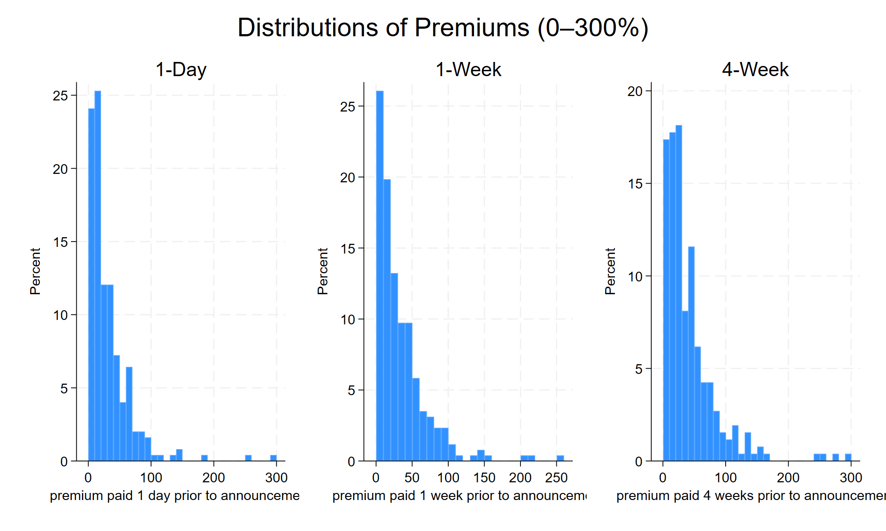

# BRICS M&A Country Risk Analysis

## Overview
This project examines the relationship between country risk and M&A deal premiums in BRICS economies between 2014 and 2024.

The research analyses how political, economic, and financial risk indicators influence acquisition premiums using empirical regression modelling.

## Objectives
- Analyse the impact of country risk on M&A deal premiums
- Compare trends across BRICS economies
- Evaluate relationships between governance indicators and acquisition pricing
- Apply econometric techniques to financial datasets

## Data Sources
- Refinitiv Eikon
- World Bank Governance Indicators
- PRS Group Risk Indicators
- Credit Rating Agency Data

## Methodology
- Data Cleaning and Merging
- Regression Analysis
- Multivariate Modelling
- Statistical Interpretation
- Data Visualisation

## Tools Used
- Stata
- Excel
- Financial Databases
- Econometric Techniques

## Key Topics
- Mergers & Acquisitions
- Country Risk
- Corporate Finance
- Financial Econometrics
- Deal Premium Analysis
- Emerging Markets

## Research Highlights
- Examined BRICS economies from 2014–2024
- Built regression models using financial and governance indicators
- Analysed relationships between political stability and acquisition premiums
- Conducted empirical analysis using real-world financial datasets

## Author
Ardra Lekshmi  
MSc Finance & Investment (CFA Pathway)  
University of Aberdeen

## Visual Analysis

### Distribution of M&A Premiums

### Average M&A Premiums Across BRICS

### Country Risk and Premium Relationship

.png)

.png)

.png)

.png)

### Regression Coefficient Plot

